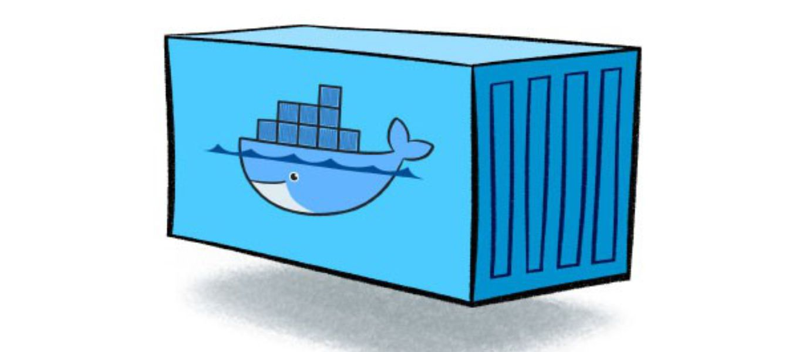
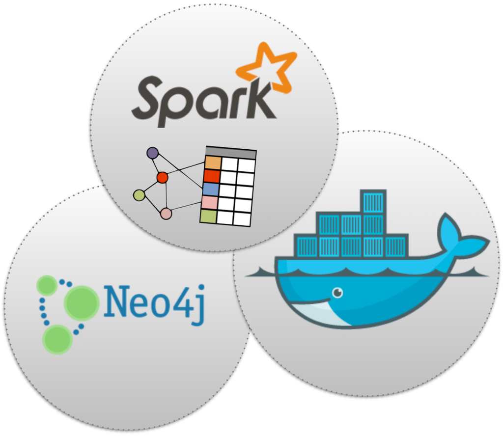
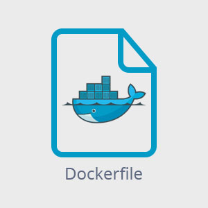

# Introduction
  - Breaking the ice
  - Vocabulary
    - Containers
    - Images
    - Dockerfile
  - Concept
    - How does it works?
    - What can you do with it?

# What's Docker?

# Containers

# Images

# Dockerfile

# How does it works?

# What can you do with it?

